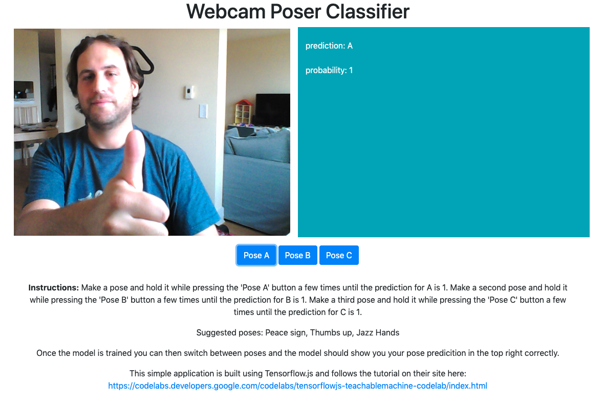

# Webcam Poser (Image) Classifier

This project is based on the [Tensorflow.js](https://www.tensorflow.org/js) image classifier tutorial https://codelabs.developers.google.com/codelabs/tensorflowjs-teachablemachine-codelab/index.html.

It uses the user's webcam to train an image classifier model to recognise 3 poses the user does for the webcam. Examples such as peace sign, 
thumbs up and jazz hands. Once trained the predictions will be shown in the top right. If the predicitions are off, just use one of the 3
buttons to train the model to recognise the pose until it predicts it reliably.

All source code for this example project can be found in index.html and index.js and it runs completely in the browser. Just open index.html locally
on your desktop to try the example.

